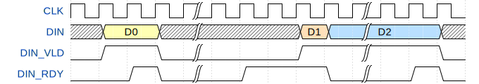
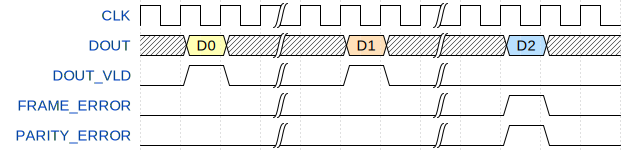
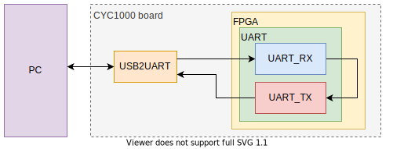
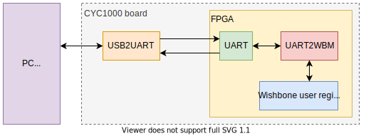

# Simple UART for FPGA

Simple UART for FPGA is UART (Universal Asynchronous Receiver & Transmitter) controller for serial communication with an FPGA. The UART controller was implemented using VHDL 93 and is applicable to any FPGA.

**Simple UART for FPGA requires: 1 start bit, 8 data bits, 1 stop bit!**

The UART controller was simulated and tested in hardware.

## UART controller:

### Generics:

```
CLK_FREQ      : integer := 50e6;   -- system clock frequency in Hz
BAUD_RATE     : integer := 115200; -- baud rate value
PARITY_BIT    : string  := "none"; -- type of parity: "none", "even", "odd", "mark", "space"
USE_DEBOUNCER : boolean := True    -- enable/disable debouncer
```

### Inputs and outputs ports:

```
-- CLOCK AND RESET
CLK          : in  std_logic; -- system clock
RST          : in  std_logic; -- high active synchronous reset
-- UART INTERFACE
UART_TXD     : out std_logic; -- serial transmit data
UART_RXD     : in  std_logic; -- serial receive data
-- USER DATA INPUT INTERFACE
DIN          : in  std_logic_vector(7 downto 0); -- input data to be transmitted over UART
DIN_VLD      : in  std_logic; -- when DIN_VLD = 1, input data (DIN) are valid
DIN_RDY      : out std_logic  -- when DIN_RDY = 1, transmitter is ready and valid input data will be accepted for transmiting
-- USER DATA OUTPUT INTERFACE
DOUT         : out std_logic_vector(7 downto 0); -- output data received via UART
DOUT_VLD     : out std_logic; -- when DOUT_VLD = 1, output data (DOUT) are valid (is assert only for one clock cycle)
FRAME_ERROR  : out std_logic; -- when FRAME_ERROR = 1, stop bit was invalid (is assert only for one clock cycle)
PARITY_ERROR : out std_logic  -- when PARITY_ERROR = 1, parity bit was invalid (is assert only for one clock cycle)
```

### User interface examples:

Example of sending data on the user interface of the UART controller.



Example of receiving data on the user interface of the UART controller. The last transaction in the example was corrupted during transmission, it contains a bad parity and stop bit.



### Table of resource usage summary:

Parity type | LE | FF | M9k | Fmax
:---:|:---:|:---:|:---:|:---:
none       | 77 | 56 | 0 | 305.5 MHz
even/odd   | 84 | 60 | 0 | 289.4 MHz
mark/space | 82 | 60 | 0 | 290.7 MHz

*Implementation was performed using Quartus Prime Lite Edition 20.1.0 for Intel Cyclone 10 FPGA (10CL025YU256C8G). Setting of some generics: USE_DEBOUNCER = True, BAUD_RATE = 115200, CLK_FREQ = 50e6.*

## Simulation:

A simulation is prepared in the repository. You can use the prepared TCL script to run simulation in ModelSim.
```
vsim -do sim/sim.tcl
```

## Examples:

The repository also includes several UART example designs. I use it on my [FPGA board CYC1000](https://shop.trenz-electronic.de/en/TEI0003-02-CYC1000-with-Cyclone-10-FPGA-8-MByte-SDRAM) with Intel Cyclone 10 FPGA (10CL025YU256C8G) and FTDI USB to UART Bridge. Here you can find [the documentation of the CYC1000 board](https://www.trenz-electronic.de/fileadmin/docs/Trenz_Electronic/Modules_and_Module_Carriers/2.5x6.15/TEI0003/REV02/Documents/CYC1000%20User%20Guide.pdf).

### UART loopback:

The UART loopback example design is for testing data transfer between FPGA and PC. Data that you send from the PC to the FPGA via UART will be automatically sent back to the PC.



### UART2WB bridge:

The UART2WB bridge example design is for testing access to Wishbone registers via the UART bridge. The example uses a simple script written in Python that allows you to read or write to 32-bit user registers connected to the [Wishbone bus](http://cdn.opencores.org/downloads/wbspec_b4.pdf).



After connecting the CYC1000 board to the PC, upload an example design to the FPGA and run the script ([Python 3](https://www.python.org) and [PySerial](https://pyserial.readthedocs.io/en/latest/shortintro.html) is required):
```
python examples/uart2wb/sw/wishbone.py
```

The expected output is:
```
Test of access to CSR (control status registers) via UART2WBM module...
=======================================================================
The UART on COM1 is open.
The wishbone bus is ready.

READ from 0x0:
0x20210406

READ from 0x4:
0xABCDEF12

WRITE 0x12345678 to 0x4.

READ from 0x4:
0x12345678

WRITE 0xABCDEF12 to 0x4.

READ from 0x4:
0xABCDEF12

READ from 0x8844:
0xDEADCAFE

The UART is closed.
```

## License:

This UART controller is available under the MIT license. Please read [LICENSE file](LICENSE).
